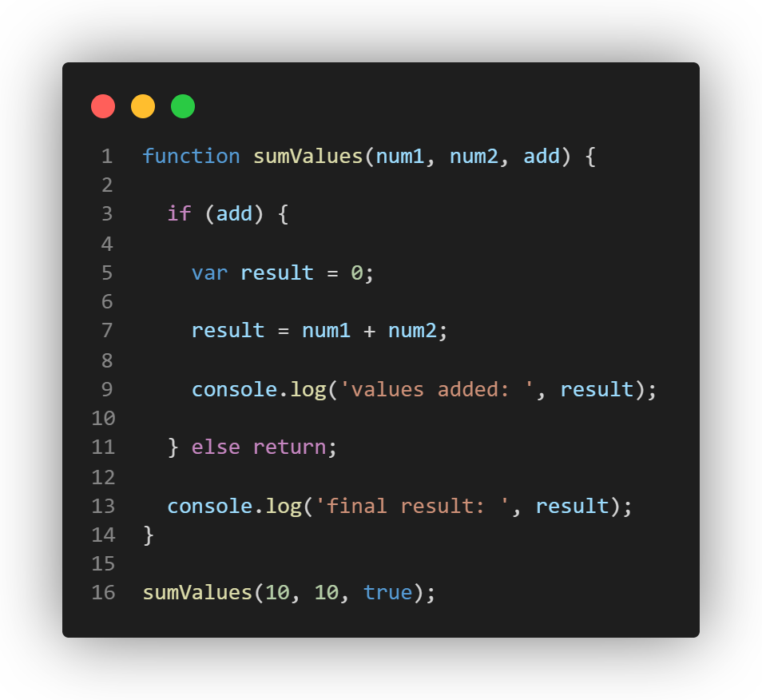
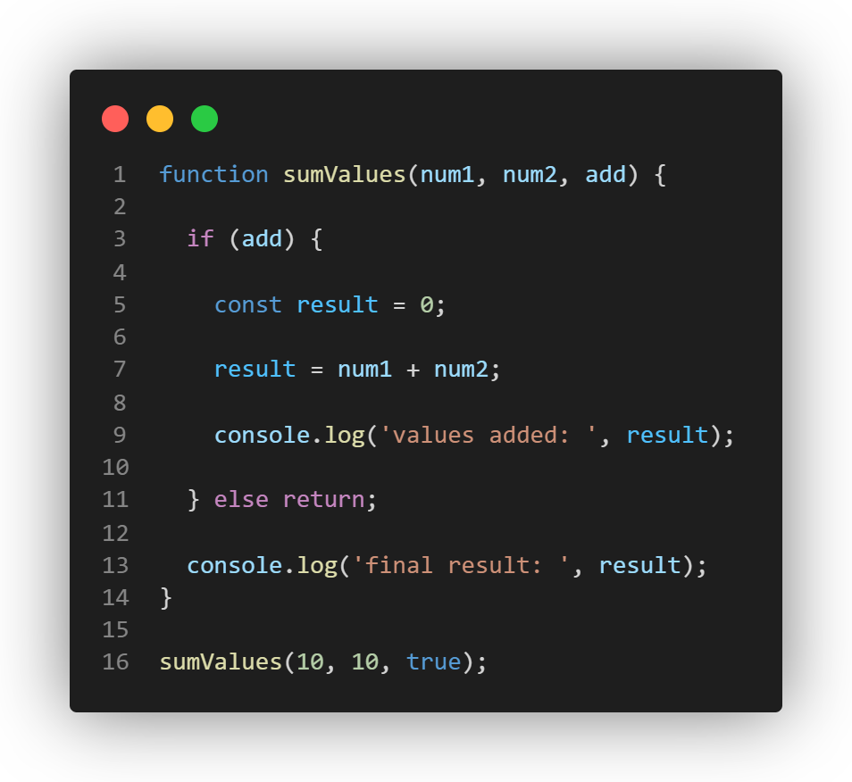

1. ### What is printed by line 9? If the code returns an error, explain why.

On line 9, the following will be printed: 

`values added: 20`

2. ### What is printed by line 13? If the code returns an error, explain why. 

`final result: 20`

3. ### Why should you not use `var`? Explain why. 

The reason why you should refrain from using `var` is that it is no longer used in modern scripts for the following reasons:
-  `var` has no block scope, either being function-scoped or global-scoped. 
- `var` tolerates redeclarations. Its modern counterpart, `let`, will raise an error should you redeclare a variable with the same name; `var` will not.
-  `var` declarations are processed at function start (for global variable declared with `var`, it'll get processed at the start of the script or .js file)

These differences make `var` worse than `let` most of the time.

---

4. ### What is printed by line 9? If the code returns an error, explain why. 

On line 9, the following will be printed: 

`values added: 20`

5. ### What is printed by line 13? If the code returns an error, explain why. 

The code in line 13 returns a `ReferenceError`. The reason why is because the variable declaration using `let` makes it so that its scope is only within the code block of the `if` condition. Therefore, there will be no reference to `result` **outside** of the code block, hence why you encounter a `ReferenceError`.

6. ### What is printed by line 9? If the code returns an error, explain why. 

The code by line 9 returns a `TypeError: Assignment to constant variable`. The reason why is because at line 7, the variable `result` was reassigned the value of the sum of `num1` and `num2`. However, this new assignment is not allowed after its been assigned for the first time. Therefore, even before line 9 could be executed, a `TypeError` was raised beforehand.

7. ### What is printed by line 13? If the code returns an error, explain why. 

The code by line 13 returns a `TypeError: Assignment to constant variable`. As mentioned for previous question, the reason why is because at line 7, the variable `result` was reassigned the value of the sum of `num1` and `num2`. However, this new assignment is not allowed after its been assigned for the first time. Therefore, even before line 13 could be executed, a `TypeError` was raised beforehand.
