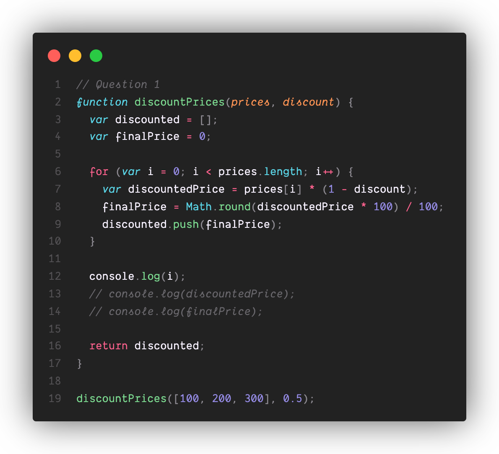
1. ### What will happen at line 12 and why? If the code causes an error, explain why.

On line 12, the following will be printed: 

`3`

The reason the console prints out `3` is because since the variable that `console.log()` is passing in, `i`, was declared using `var`, the variable `i` has function-scope and therefore can still be referenced even after the for-loop is completed. Hence why at line 12 there were no errors raised. The value `3` is from the number of iterations the for-loop performed for each element in the list `prices`

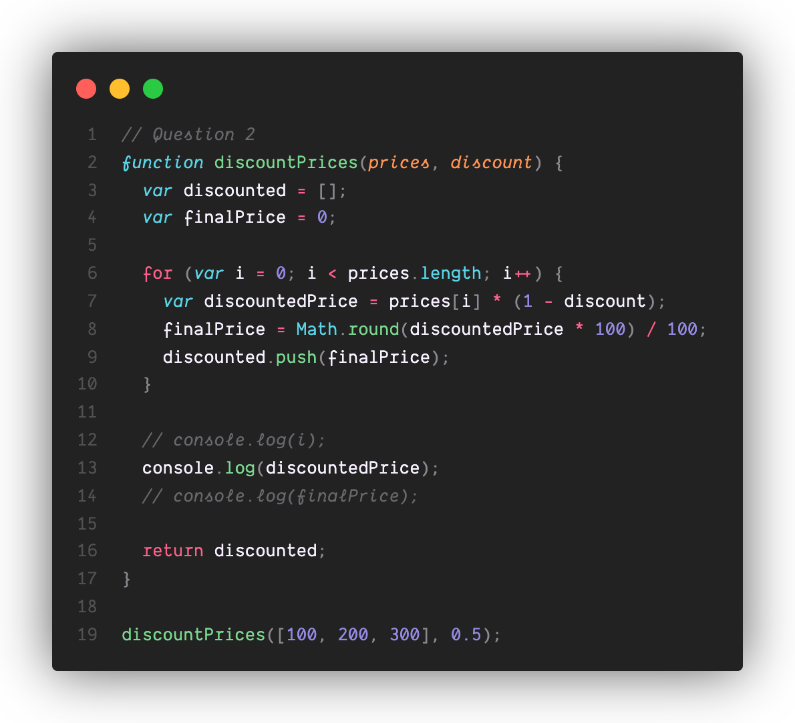

2. ### What will happen at line 13 and why? If the code causes an error, explain why.

On line 13, the following will be printed: 

`150`

The reason the console prints out `150` is because since the variable that `console.log()` is passing in, `discountedPrice`, was declared using `var`, the variable `discountedPrice` has function-scope and therefore can still be referenced even after the for-loop is completed. Hence why at line 13 there were no errors raised. The value `150` is the calculated discounted price for the **last** element in the list of `prices` at a 50% discount. 

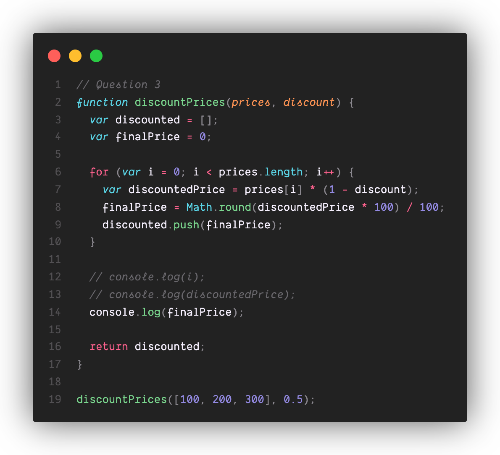

3. ### What will happen at line 14 and why? If the code causes an error, explain why.

On line 14, the following will be printed: 

`150`

The reason the console prints out `150` is because since the variable that `console.log()` is passing in, `finalPrice`, was declared using `var`, the variable `finalPrice` has function-scope and therefore can still be referenced anywhere within the function. Hence why at line 14 there were no errors raised. The value `150` is the rounded version of `discountedPrice` to two decimal places.

4. ### What will this function return? Give a brief explanation why. If the code causes an error, explain why.

Although it may not seem that the function doesn't return anything since the console does not print anything even after call the function `discountPrices`, the function does return the list `discounted`. More specifically, given a list of integers `prices` and a double `discount`, the function returns the prices of each element in `prices` after applying a discount of `discount` percent. This will be rounded to the last two integers. Each and every discounted price will be appended to `discount` and is returned.

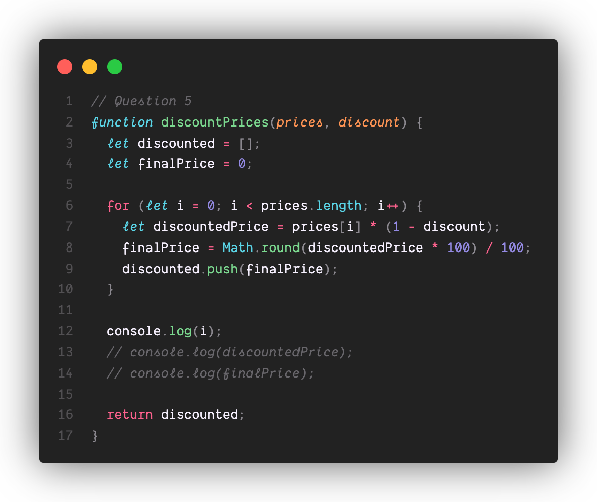

5. ### What will happen at line 12 and why?  If the code causes an error, explain why. ^^^ (assume this function is being called like the others: discountPrices([100, 200, 300], 0.5)).

The code in line 12 returns a `ReferenceError`. The reason why is because the variable declaration for `i` using `let` makes it so that `i`'s scope is within the code block of the for-loop. Therefore, there will be no reference to `i` **outside** of the code block, hence why you encounter a `ReferenceError` when you try to print `i` outside the code block with `console.log(i)`.

6. ### What will happen at line 13 and why? If the code causes an error, explain why.

The code in line 12 returns a `ReferenceError`. The reason why is because the variable declaration for `discountedPrice` using `let` makes it so that `discountedPrice`'s scope is within the code block of the for-loop. Therefore, there will be no reference to `discountedPrice` **outside** of the code block, hence why you encounter a `ReferenceError` when you try to print `discountedPrice` outside the code block with `console.log(discountedPrice)`.

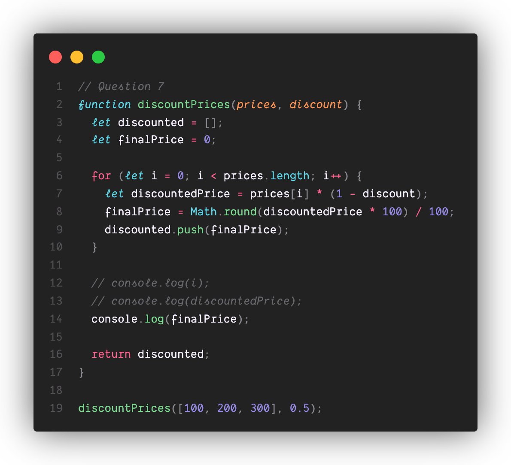

7. ### What will happen at line 14 and why? If the code causes an error, explain why.
   
On line 14, the following will be printed: 

`150`

The reason the console prints out `150` is because since the variable that `console.log()` is passing in, `finalPrice`, was declared using `let`, the variable `finalPrice` has function-scope and therefore can still be referenced anywhere within the function. Hence why at line 14 there were no errors raised. The value `150` is the rounded version of `discountedPrice` to two decimal places for the last element in the list of `prices`.

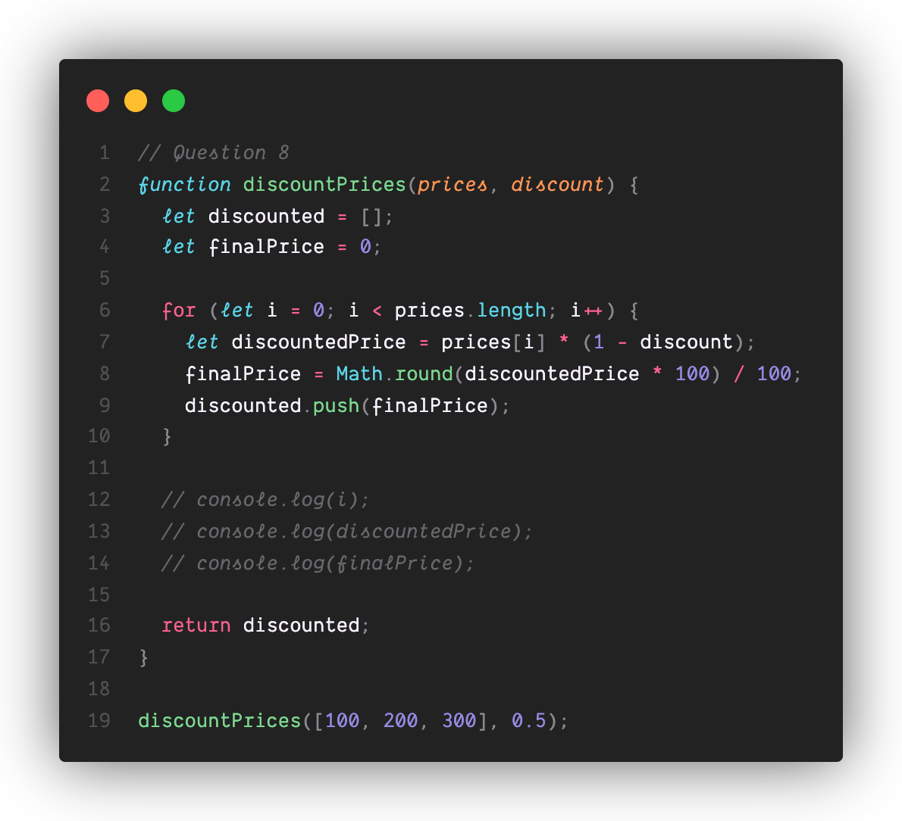

8. ### What will this function return? Give a brief explanation. If the code causes an error, explain why.

Although it may not seem that the function doesn't return anything since the console does not print anything even after call the function `discountPrices`, the function does return the list `discounted`. More specifically, given a list of integers `prices` and a double `discount`, the function returns the prices of each element in `prices` after applying a discount of `discount` percent. This will be rounded to the last two integers. Each and every discounted price will be appended to `discount` and is returned.

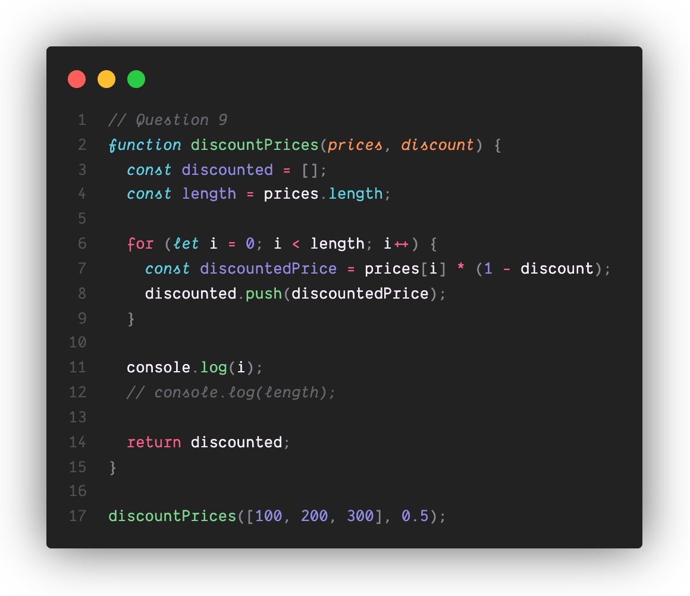

9. ### What will happen at line 11 and why? If the code causes an error, explain why.

The code in line 12 returns a `ReferenceError`. The reason why is because the variable declaration for `i` using `let` makes it so that `i`'s scope is within the code block of the for-loop. Therefore, there will be no reference to `i` **outside** of the code block, hence why you encounter a `ReferenceError` when you try to print `i` outside the code block with `console.log(i)`.

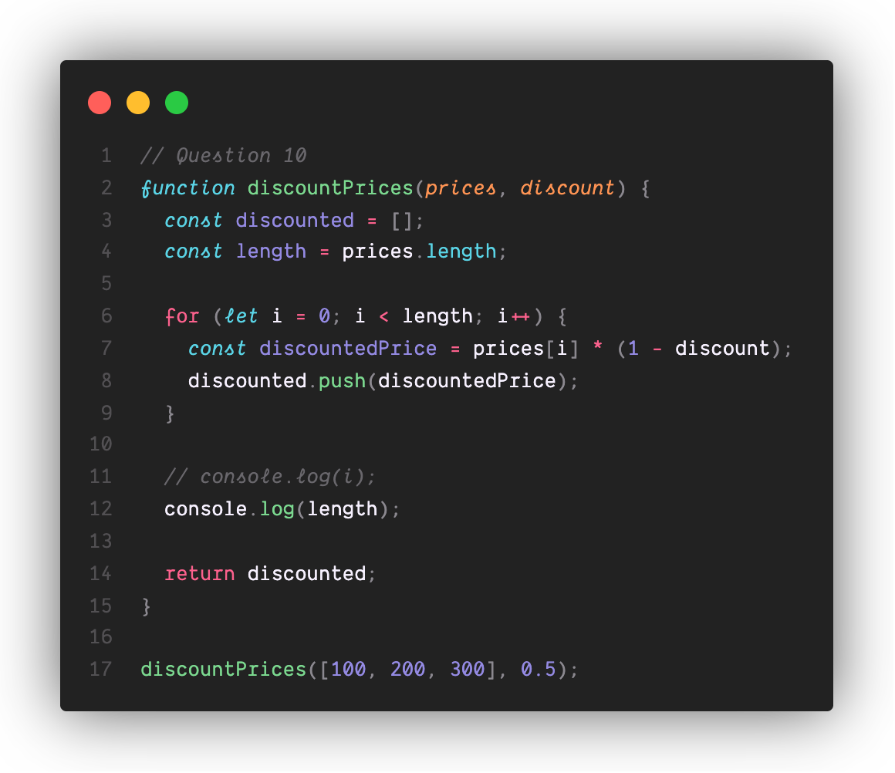

10.  ### What will happen at line 12 and why? If the code causes an error, explain why. 

On line 14, the following will be printed: 

`3`

The reason the console prints out `3` is because since the variable that `console.log()` is passing in, `length`, was declared using `const`, similar in scope to`let`, the variable `length` has function-scope and therefore can still be referenced anywhere within the function. However, any reassignment of `length` raises an error, luckily there no line that does that here. The value `3` denotes the number of elements present in the `prices` list.

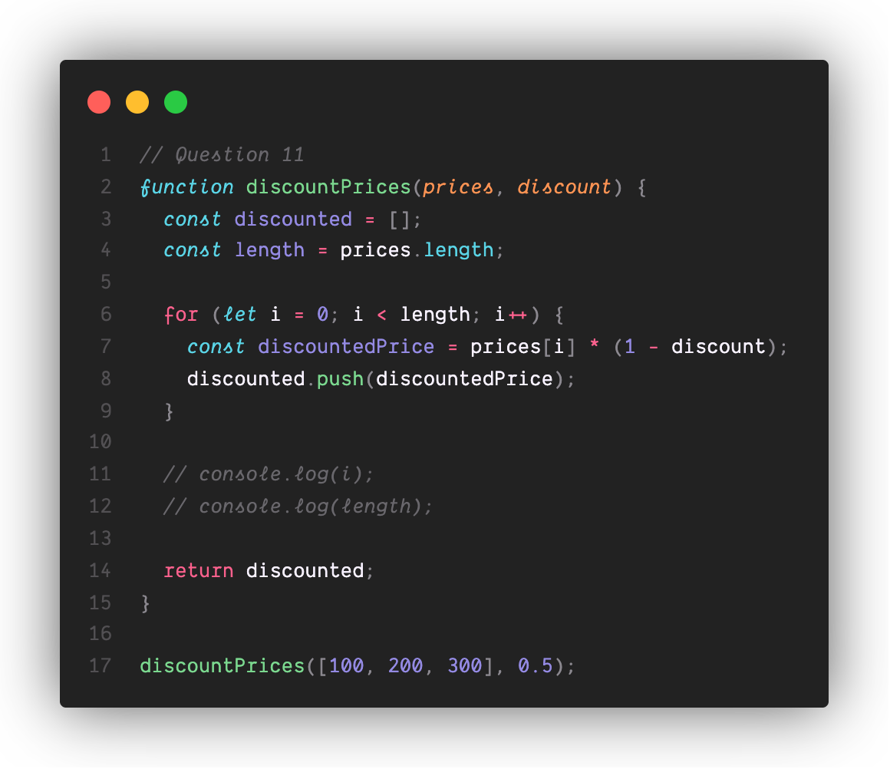

11.  ### What will this function return? Give a brief explanation. If the code causes an error, explain why.

Although it may not seem that the function doesn't return anything since the console does not print anything even after call the function `discountPrices`, the function does return the list `discounted`. More specifically, given a list of integers `prices` and a double `discount`, the function returns the prices of each element in `prices` after applying a discount of `discount` percent. This will be rounded to the last two integers. Each and every discounted price will be appended to `discount` and is returned.

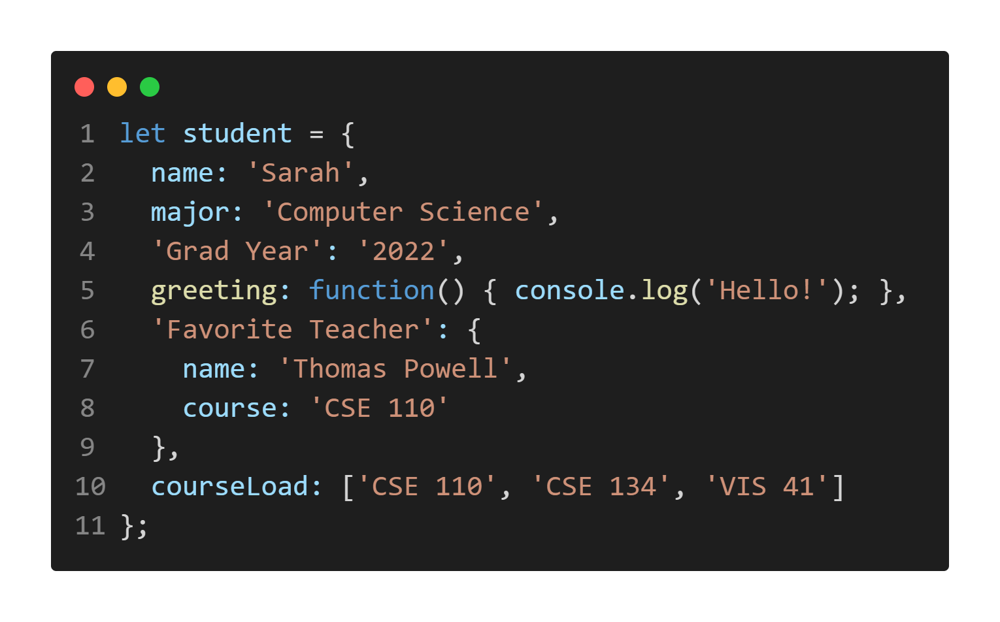

12. ### Given the above Object, write the notation for:  (These should be in your part2.md)
- Accessing the value of the name property in the student object

`student.name`

- Accessing the value of the Grad Year property in the student object

`student['Grad Year']`

- Calling the function for the greeting property in the student object

`student.greeting()`

- Accessing the name property of the object in the Favorite Teacher property in student

`student['Favorite Teacher'].name`

- Access index zero in the array of the courseLoad property of the student object

`student.courseLoad[0]`

13.   ### For each of the following questions, note down the output as well as a brief explanation why that output was given. **Arithmetic**
- **'3' + 2**

`'32'`. String conversion for when we need to output the concatenation between a string and an integer.

- **'3' - 2**

`1`. Numeric conversion for the math operation subtraction, can't exactly apply the opposite of concatenation.

- **3 + null**

`3`. The value `null` becomes 0, thus the operation is 3 + 0.

- **'3' + null**

`'3null'`. The value `null` becomes a string and a string concatenation is performed since `3` is also a string and the math operation is addition.

- **true + 3**

`4`. A `true` will become a numeric value so it can be summed up with the integer `3`.

- **false + null**

`0`. A `false` and `null` are both intuitively "empty". And so, the addition of both values will become integers `0` + `0`.

- **'3' + undefined**

`3undefined`. The value `undefined` becomes a string and a string concatenation is performed since `3` is also a string and the math operation is addition.

- **'3' - undefined**

`NaN`. The math operation of subtracting an undefined value to a string. You can't subtract from a string and so the value just becomes `Nan`.

14.   ### For each of the following questions, note down the output as well as a brief explanation why that output was given. **Comparison**
- **'2' > 1**

`true`. The string '2' is converted to a number 2 for the comparison. Since 2 > 1, the result is true.

- '2' < '12'

`false`. When comparing two strings, JavaScript performs a lexicographical comparison. `2` comes after `12` lexicographically, so the result is `false`.

- 2 == '2'

`true`. The `==` operator performs **type coercion**, converting the string `'2'` to the number `2` before comparison. Since `2 == 2`, the result is `true`.

- 2 === '2'

`false`. The `===` operator checks for both value and type equality. Since `2` is a number and `'2'` is a string, the result is `false`.

- true == 2

`false`. The `==` operator converts true to `1` for comparison. Since `1 != 2`, the result is `false`.

- true === Boolean(2)

`true`. The `Boolean(2)` converts the number `2` to true because any non-zero number is true. Since both sides are true and of the same type, the result is `true`.

15.   ### Explain the difference between the == and === operators.

The strict equality operator `===` checks the equality without type conversion. However, the double equality sign `==` means the equality test with type conversion.

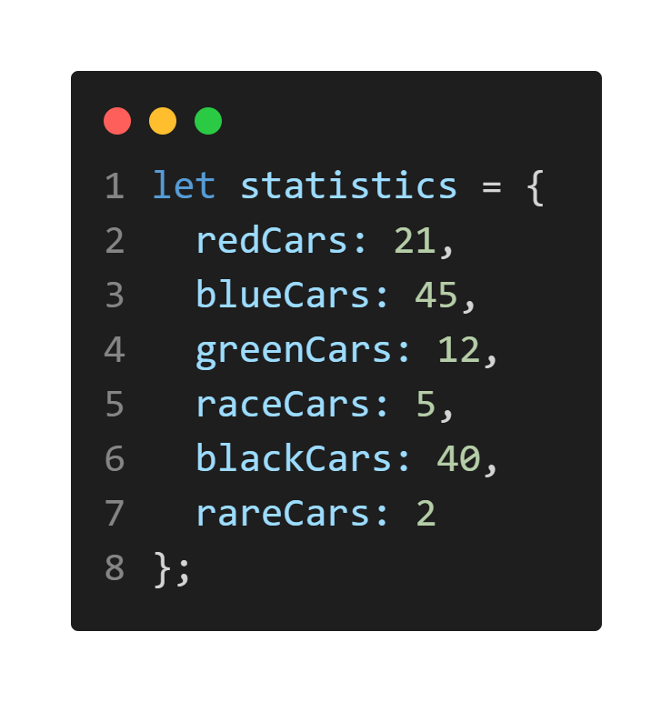

16.  ### Given the above Object, write a for...in loop that will iterate through it and print out the value of the property if the property starts with the letter r, or if the value of that property is an odd number.  (This should be in a JS file part2-question16.js)

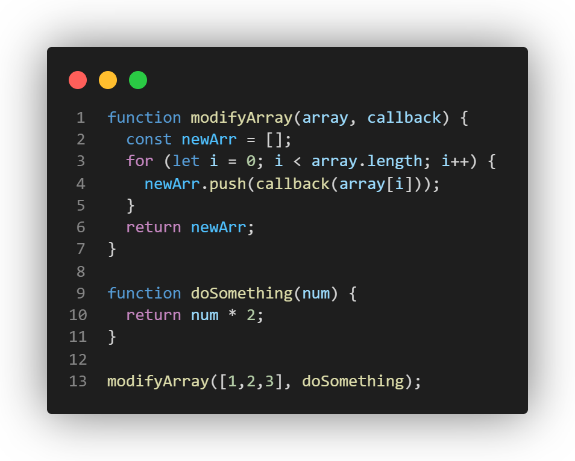

17.  ### If the function above is called with the following parameters modifyArray([1,2,3], doSomething), what will be the result? Briefly walk through how you arrived at that result. (This should be in your part2.md). Here we are passing in a function as a parameter, however we can also return a function from another function just as easily, you're encouraged to play around with callbacks as they are used heavily in frontend JS development. 

When `modifyArray([1, 2, 3], doSomething)` is called, the result is `[2, 4, 6]`. The `modifyArray` function iterates through the array `[1, 2, 3]`, applying the `doSomething` callback (which doubles the input) to each element. The results are stored in a new array, which is returned.

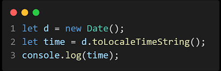

18. ### The above program only prints out the time once when executed. Modify this code such that the program prints out the current time every second.  (This should be a JS file - part2-question18.js)

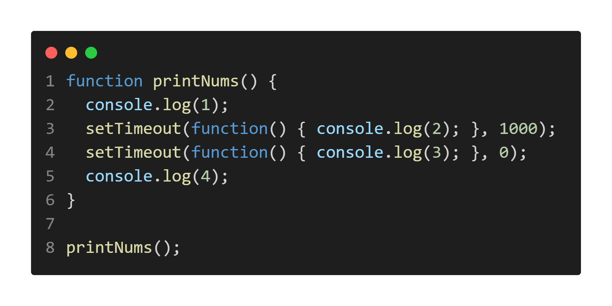

19.  ### What is the output of the above code? (This should be in your part2.md)

The following will be the output of the code above: 

`1`, `4`, `3`, `2`

The reason why is that `console.log(1)` is executed first, so `1` is printed immediately. `setTimeout` with a delay of 1000ms and 0ms schedules `console.log(2)` and `console.log(3)`to run after 1 and 0 seconds respectively. Both of which will run as soon as the current execution stack is cleared. And so, `console.log(4)` is executed next. Once the stack is cleared, `3` and `2` is printed, where `3` is printed first since its delay is 0ms compared `2`, whose delay was by 1 second.